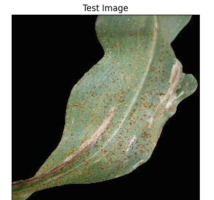
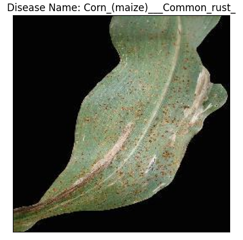

# 🌿 Plant Disease Detection System

Deep Learning based Plant Disease Detection and Classification System built using **TensorFlow**, **Keras**, **CNN**, and deployed with **Streamlit**.

The model classifies multiple plant leaf diseases from images with high accuracy and provides real-time predictions through a web application.

---

# 📌 Project Overview

This project uses a **Convolutional Neural Network (CNN)** to detect and classify plant diseases from leaf images.

The system:

- Trains a CNN model using plant disease image datasets
- Evaluates model performance using:
  - Accuracy
  - Loss
  - Precision
  - Recall
  - F1-Score
  - Confusion Matrix
- Predicts disease from a single uploaded image
- Deploys the trained model as a web app using Streamlit

---

# 🚀 Features

✅ Plant Disease Classification  
✅ Deep Learning CNN Model  
✅ High Accuracy (~96%)  
✅ Real-time Image Prediction  
✅ Streamlit Web Application  
✅ Confusion Matrix Visualization  
✅ Classification Report  
✅ Training Accuracy Visualization

---

# 🧠 Technologies Used

- Python
- TensorFlow
- Keras
- NumPy
- Matplotlib
- OpenCV
- Scikit-learn
- Streamlit

---

# 📂 Project Structure

```bash
Plant-Disease-Detection/
│
├── train.ipynb
├── train1.ipynb
├── main.py
├── trained_plant_disease_model.keras
├── labels.txt
├── requirements.txt
├── README.md
│
├── train/
├── valid/
├── test/
│
└── images/
```

---

# 📥 Dataset

The dataset contains images of healthy and diseased plant leaves.

Classes include:

- Apple
- Blueberry
- Cherry
- Corn
- Grape
- Orange
- Peach
- Pepper
- Potato
- Raspberry
- Soybean
- Squash
- Strawberry
- Tomato

Diseases include:

- Apple Scab
- Black Rot
- Cedar Apple Rust
- Powdery Mildew
- Leaf Spot
- Early Blight
- Late Blight
- Mosaic Virus
- Spider Mites
- Yellow Curl Virus
- etc.

---

# ⚙️ Model Training

## Training Configuration

```python
training_history = cnn.fit(
    x=training_set,
    validation_data=validation_set,
    epochs=10
)
```

---

# 📊 Initial Training Results

## Epoch Results

| Epoch | Training Accuracy | Validation Accuracy | Training Loss | Validation Loss |
| ----- | ----------------- | ------------------- | ------------- | --------------- |
| 1     | 0.4222            | 0.6031              | 1.9404        | 1.2609          |
| 2     | 0.7013            | 0.7311              | 0.9291        | 0.8374          |
| 3     | 0.7830            | 0.7737              | 0.6652        | 0.7184          |
| 4     | 0.8269            | 0.8012              | 0.5193        | 0.6249          |
| 5     | 0.8529            | 0.8205              | 0.4337        | 0.5654          |
| 6     | 0.8716            | 0.8133              | 0.3802        | 0.6275          |
| 7     | 0.8844            | 0.8322              | 0.3448        | 0.5495          |
| 8     | 0.8910            | 0.8467              | 0.3215        | 0.5165          |
| 9     | 0.9008            | 0.8486              | 0.2953        | 0.5040          |
| 10    | 0.9051            | 0.8381              | 0.2772        | 0.5830          |

---

# 📈 Improved Model Training

To improve model performance, a second notebook called:

```bash
train1.ipynb
```

was created.

---

# 🔧 Enhancements Made

## 1. Increase Dense Layer Units

Changed:

```python
cnn.add(layers.Dense(units=1024, activation='relu'))
```

To:

```python
cnn.add(layers.Dense(units=2000, activation='relu'))
```

---

## 2. Reduce Dropout

Changed:

```python
cnn.add(layers.Dropout(0.5))
```

To:

```python
cnn.add(layers.Dropout(0.25))
```

---

# ✅ Improved Training Results

| Metric   | Before | After  |
| -------- | ------ | ------ |
| Accuracy | 0.9051 | 0.9836 |
| Loss     | 0.2772 | 0.0506 |

---

# 📊 Final Model Performance

## Training Accuracy

```python
Training accuracy: 0.9884
```

## Validation Accuracy

```python
Validation accuracy: 0.9614
```

---

# 📉 Accuracy Visualization

The graph compares:

- Training Accuracy
- Validation Accuracy

over 10 epochs.

Observations:

- Accuracy continuously improved during training
- Validation accuracy stabilized near 95%+
- The improved model significantly reduced loss

---

# 📋 Classification Report

Final evaluation metrics:

| Metric    | Score |
| --------- | ----- |
| Accuracy  | 96%   |
| Precision | 96%   |
| Recall    | 96%   |
| F1-Score  | 96%   |

---

# 🧪 Sample Prediction

## Input Test Image

```python
image_path = '/test/CornCommonRust1.JPG'
```



The model successfully predicted:

```bash
Disease Name: Apple___Cedar_apple_rust
```



---

# 🔍 Confusion Matrix

The confusion matrix demonstrates strong classification performance across multiple plant disease classes.

Most predictions lie on the diagonal, indicating high accuracy and low misclassification.

---

# 🧠 Model Optimization Notes

## To Avoid Overshooting Loss Function

- Choose small learning rate
  - Default learning rate = `0.001`
  - Used learning rate = `0.0001`

- Increase number of neurons to avoid underfitting

- Add more convolutional layers to extract more features

- Add dropout layers:
  - Before Flatten layer
  - Before Output layer

---

# ⚡ To Avoid High Number of Parameters

Remove:

```python
padding='same'
```

from second convolution layers.

Using default:

```python
padding='valid'
```

makes the model lighter and easier to train.

---

# 📈 Model Evaluation

## Training Set Accuracy

```python
train_loss, train_acc = cnn.evaluate(training_set)
print('Training accuracy:', train_acc)
```

Output:

```bash
Training accuracy: 0.9884760975837708
```

---

## Validation Set Accuracy

```python
val_loss, val_acc = cnn.evaluate(validation_set)
print('Validation accuracy:', val_acc)
```

Output:

```bash
Validation accuracy: 0.9614371061325073
```

---

# 📋 Precision, Recall, and F1 Score

```python
print(classification_report(
    y_true,
    predicted_categories,
    target_names=class_name,
    zero_division=0
))
```

Results showed strong performance across most classes with:

- Precision ≈ 96%
- Recall ≈ 96%
- F1-score ≈ 96%

---

# 🌐 Streamlit Deployment

The trained CNN model was deployed using **Streamlit** to create a web application for plant disease prediction.

---

# 📦 Install Streamlit

```bash
pip install streamlit
```

If you face issues with `starlette`:

```bash
pip install --upgrade streamlit starlette
```

---

# ▶️ Run the Streamlit App

```bash
streamlit run main.py
```

or

```bash
python -m streamlit run main.py
```

---

# 🖥️ Streamlit App Features

The Streamlit application allows users to:

- Upload plant leaf images
- View uploaded image
- Predict plant disease
- Display prediction confidence
- Show disease name instantly

---

# 🧾 Example Streamlit Workflow

## 1. Upload Image

User uploads a plant leaf image.

---

## 2. Image Preprocessing

```python
image = tf.keras.preprocessing.image.load_img(
    image_path,
    target_size=(128,128)
)
```

Convert image to array:

```python
input_arr = tf.keras.preprocessing.image.img_to_array(image)
```

Convert single image to batch:

```python
input_arr = np.array([input_arr])
```

---

## 3. Model Prediction

```python
predictions = cnn.predict(input_arr)
```

---

## 4. Display Result

```python
model_prediction = class_name[result_index]

plt.imshow(img)
plt.title(f"Disease Name: {model_prediction}")
plt.xticks([])
plt.yticks([])
plt.show()
```

Output:

```bash
Disease Name: Apple___Cedar_apple_rust
```

---

# 🛠️ TensorFlow + NumPy Compatibility Fix

Inside the activated TensorFlow environment run EXACTLY:

```bash
pip uninstall tensorflow numpy -y
```

Then install compatible versions:

```bash
pip install numpy==1.23.5
pip install tensorflow==2.10.0
```

---

# 📦 Requirements

Create a `requirements.txt` file:

```txt
tensorflow==2.10.0
numpy==1.23.5
opencv-python
matplotlib
scikit-learn
streamlit
pandas
```

---

# ▶️ How to Run the Project

## 1. Clone Repository

```bash
git clone https://github.com/your-username/Plant-Disease-Detection.git
```

---

## 2. Create Environment

```bash
conda create -n tensorflow python=3.9
conda activate tensorflow
```

---

## 3. Install Dependencies

```bash
pip install -r requirements.txt
```

---

## 4. Train Model

```bash
jupyter notebook
```

Open:

```bash
train.ipynb
```

or

```bash
train1.ipynb
```

---

## 5. Run Streamlit App

```bash
streamlit run main.py
```

---

# 📸 Application Output

The application predicts diseases such as:

- Apple Scab
- Cedar Apple Rust
- Tomato Early Blight
- Powdery Mildew
- Leaf Mold
- Mosaic Virus
- Healthy Leaves

with high confidence.

---

# 🔮 Future Improvements

- Mobile Application Deployment
- Transfer Learning (EfficientNet / ResNet)
- Real-time Camera Detection
- Disease Treatment Recommendation
- Multi-language Support
- Cloud Deployment

---

# 🤝 Contributing

Pull requests are welcome.

For major changes, please open an issue first to discuss proposed updates.

---

# 📜 License

This project is licensed under the MIT License.

---

# 👨‍💻 Author

Plant Disease Detection System using Deep Learning and Streamlit Deployment.
